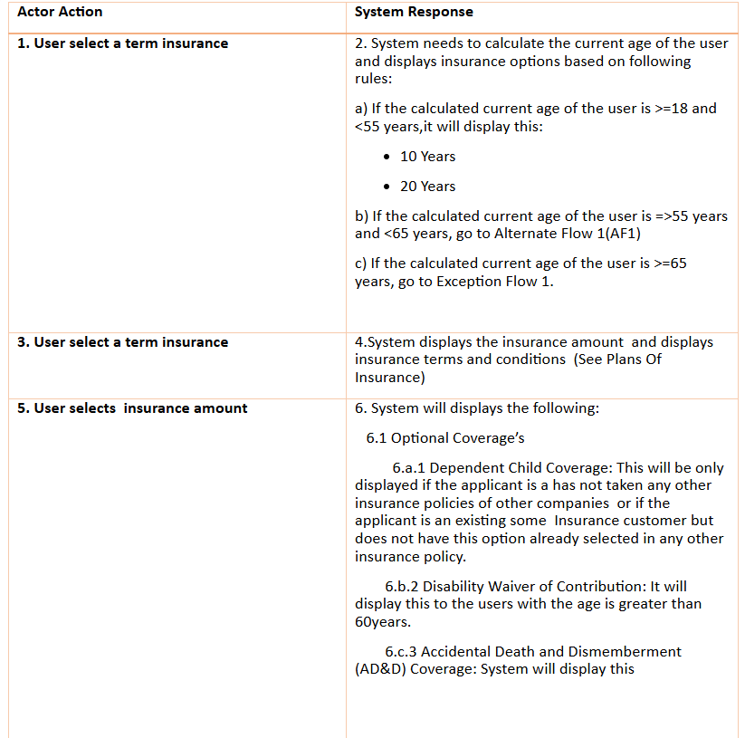
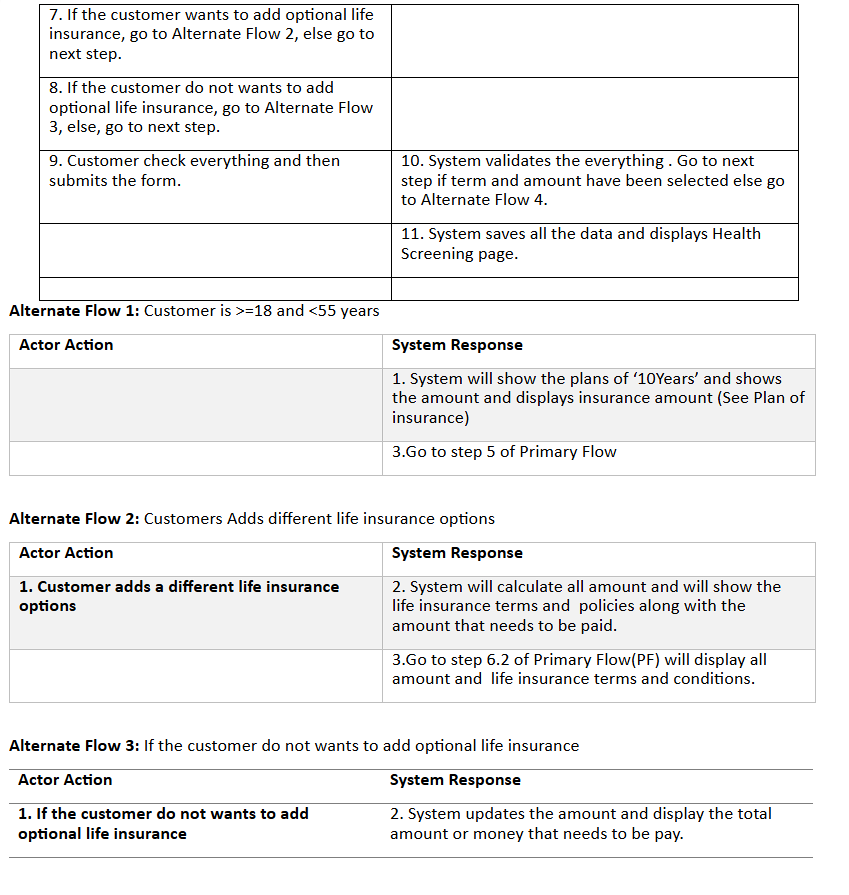
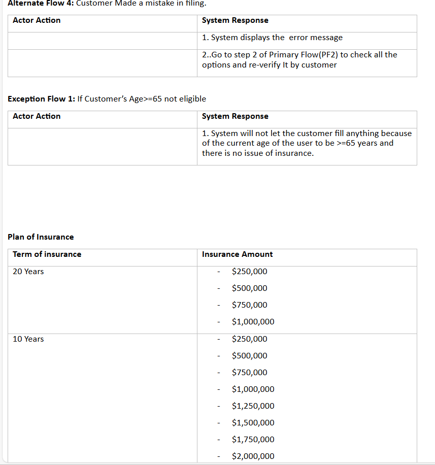

# LifeInsurance
This document is Use case for Self Service Life Insurance  
In this document one can see the how the user can register on the life insurance portal and apply for life insurance  
I have mentined the business process flow of users who can register or login in this portal  
and buy life insurance. 
This portal is only applicable for the users who age is not greater than 65. If user wants to buy the life insurance  
then one has to less than the age 65. The users cannot purchase the life insurance.  

 
 
 
